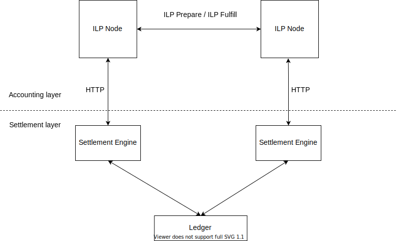

[](https://hub.docker.com/repository/docker/groman99/ilp-iroha-settlement)

# ilp-iroha-settlement

> #### [RFC](https://interledger.org/rfcs/0038-settlement-engines)-compliant [Interledger](https://interledger.org) settlement engine for [Hyperledger Iroha](https://github.com/hyperledger/iroha)



## Installation

Up-to-date images are available on Docker Hub:
```bash
docker pull groman99/ilp-iroha-settlement
```

You can also build directly from source with Maven:
```bash
mvn install
```

## Examples

Several examples illustrating the integration between Hyperledger Iroha and the Interledger protocol can be found in the [`examples`](,/examples) directory.
