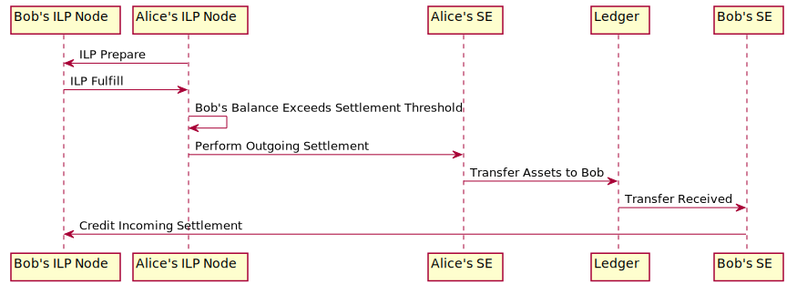

## iroha-payment

This example illustrates a simple payment between two parties that reside on the same underlying Iroha network, building upon the [`setup-accounts`](../setup-accounts) example.

Once all needed accounts have been set up, the parties can freely transact with one another.
At one time or another, the unsettled balances between the two transacting peers will exceed their preset thresholds, meaning that a settlement must be performed before any transactions can further occur.
ILP connectors intruct the settlement engines to perform settlements and settlement engines notify connectors of any incoming payments so that the balances can be updated accordingly.

The following diagram depicts the process of making a payment from Alice to Bob and settling the payment on the underlying Iroha ledger.

