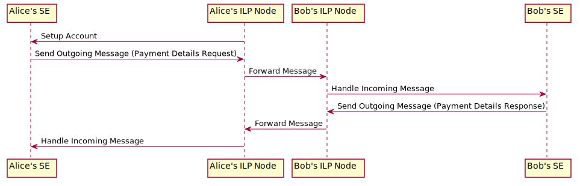

## setup-accounts

This particular example shows how ILP accounts are set up in the context of two transacting parties - Alice and Bob - each operating within their own ILP connector.

In order for Alice and Bob to connect they must have added each other as an account, that is Alice's connector must have created an account for Bob and Bob's connector must have created an account for Alice.
This setup process will trigger corresponding account setup actions on each connector's settlement engine.
This is needed in order for the settlement engines to exchange the ledger identifiers that will be used when performing settlements.
The settlement engines are able to exchange arbitrary messages via their ILP connectors that act as proxies.

The following diagram illustrates the process of creating Bob's account on Alice's connector from the perspective of the settlement engine.
The other side for creating Alice's account on Bob's connector is symmetric.

